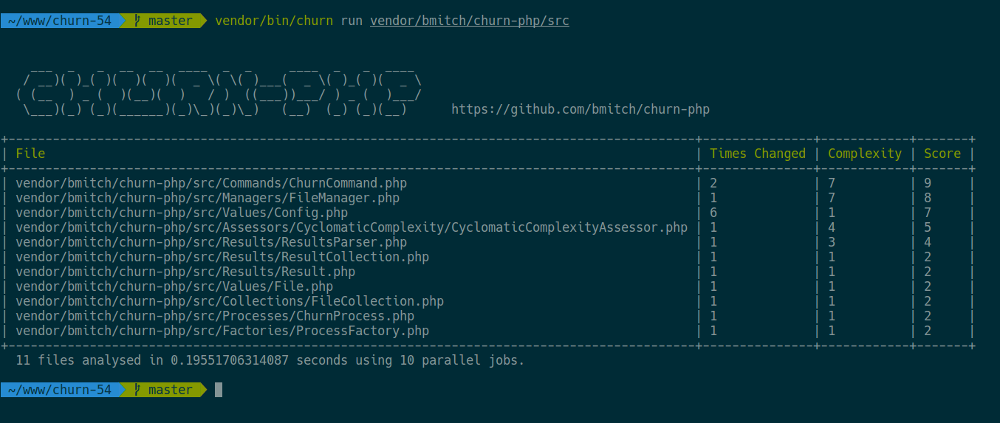

# churn-php
Helps discover good candidates for refactoring.

[](https://github.com/bmitch/churn-php/actions)
[](https://codecov.io/gh/bmitch/churn-php)
[](https://scrutinizer-ci.com/g/bmitch/churn-php/?branch=master)
[](https://codeclimate.com/github/bmitch/churn-php)
[](https://packagist.org/packages/bmitch/churn-php)
[](https://packagist.org/packages/bmitch/churn-php/stats)
[](LICENSE.md)
[](https://paypal.me/bmitch2112)
----------

## Table of Contents
* [What Is it?](#what-is-it)
* [Compatibility](#compatibility)
* [How to Install?](#how-to-install)
* [How to Use?](#how-to-use)
* [How to Configure?](#how-to-configure)
* [Similar Packages](#similar-packages)
* [Contact](#contact)
* [Contributing](#contributing)
* [License](#license)

## What is it?
`churn-php` is a package that helps you identify php files in your project that could be good candidates for refactoring.
It examines each PHP file in the path it is provided and:
* Checks how many commits it has.
* Calculates the cyclomatic complexity.
* Creates a score based on these two values.

The results are displayed in a table:



A file that changes a lot and has a high complexity might be a better candidate for refactoring than a file that doesn't change a lot and has a low complexity.

`churn-php` only assists the developer to identify files for refactoring.
It's best to use the results in addition to your own judgment to decide which files you may want to refactor.

## Compatibility
* PHP 7.1+
* Composer 2.0+

## How to Install?
Download the [last release](https://github.com/bmitch/churn-php/releases/latest) of `churn.phar`
or install it with [Phive](https://phar.io/):
```sh
phive install churn
```

You can also install `churn-php` via Composer:
```sh
composer require bmitch/churn-php --dev
```

## How to Use?
```sh
churn run <one or more paths to source code> ...
churn run src
churn run src tests

# the command name can be skipped if directoriesToScan is set in churn.yml
churn
```

## How to Configure?
You may add an optional `churn.yml` file which can be used to configure churn-php.
The location of this file can be customized using the `--configuration` option:

```sh
# Default: "churn.yml" or "churn.yml.dist"
churn run --configuration=config-dir/ <path>
churn run --configuration=my-config.yml <path>
```
A sample `churn.yml` file looks like:

```yml
# The maximum number of files to display in the results table.
# Default: 10
filesToShow: 10

# The minimum score a file need to display in the results table.
# Disabled if null.
# Default: 0.1
minScoreToShow: 0

# The command returns an 1 exit code if the highest score is greater than the threshold.
# Disabled if null.
# Default: null
maxScoreThreshold: 0.9

# The number of parallel jobs to use when processing files.
# Default: 10
parallelJobs: 10

# How far back in the VCS history to count the number of commits to a file
# Can be a human readable date like 'One week ago' or a date like '2017-07-12'
# Default: '10 Years ago'
commitsSince: One year ago

# Files to ignore when processing. The full path to the file relative to the root of your project is required.
# Also supports regular expressions.
# Default: All PHP files in the path provided to churn-php are processed.
filesToIgnore:
 - src/Commands/ChurnCommand.php
 - src/Results/ResultsParser.php
 - src/Foo/Ba*

# File extensions to use when processing.
# Default: php
fileExtensions:
 - php
 - inc

# This list is used only if there is no argument when running churn.
# Default: <empty>
directoriesToScan:
 - src
 - tests/

# List of user-defined hooks.
# They can be referenced by their full qualified class name if churn has access to the autoloader.
# Otherwise the file path can be used as well.
# See below the section about hooks for more details.
# Default: <empty>
hooks:
 - Namespace\MyHook
 - path/to/my-hook.php

# The version control system used for your project.
# Accepted values: fossil, git, mercurial, subversion, none
# Default: git
vcs: git

# The path of the cache file. It doesn't need to exist before running churn.
# Disabled if null.
# Default: null
cachePath: .churn.cache
 ```

If a `churn.yml` file is omitted or an individual setting is omitted the default values above will be used.

### Output formats

You can configure `churn` to output the result in different formats. The available formats are:

* `csv`
* `json`
* `markdown`
* `text` (default)

To use a different format use `--format` option. Example command for `json`: 

```bash
churn run --format json
```

### Hooks

The *hooks* configuration allows you to customize `churn`.

A user-defined hook must implement at least one Hook interface:

| Hook interface | Corresponding event interface |
|----------------|-------------------------------|
| [AfterAnalysisHook](src/Event/Hook/AfterAnalysisHook.php) | [AfterAnalysis](src/Event/Event/AfterAnalysis.php) |
| [AfterFileAnalysisHook](src/Event/Hook/AfterFileAnalysisHook.php) | [AfterFileAnalysis](src/Event/Event/AfterFileAnalysis.php) |
| [BeforeAnalysisHook](src/Event/Hook/BeforeAnalysisHook.php) | [BeforeAnalysis](src/Event/Event/BeforeAnalysis.php) |

## Similar Packages
* https://github.com/danmayer/churn (Ruby)
* https://github.com/chad/turbulence (Ruby)

## Contact
Questions, comments, feedback? [@bmitch2112](https://twitter.com/bmitch2112)

## Contributing
* Please run `composer test` on PHP 7.1 and ensure it passes.
* If you don't have access to PHP 7.1 please make sure that CI build passes when you make pull request.
  If you are unable to get it to pass in the pull request please ping me and I can help.
* Please see [CONTRIBUTING.md](CONTRIBUTING.md)

## License
The MIT License (MIT). Please see [License File](LICENSE.md) for more information.
